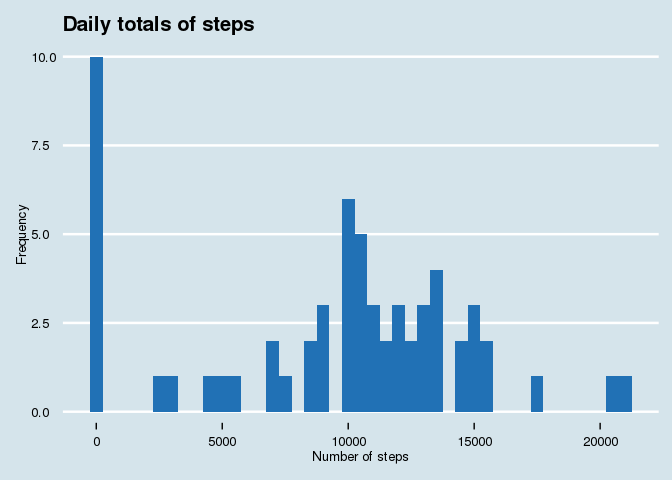
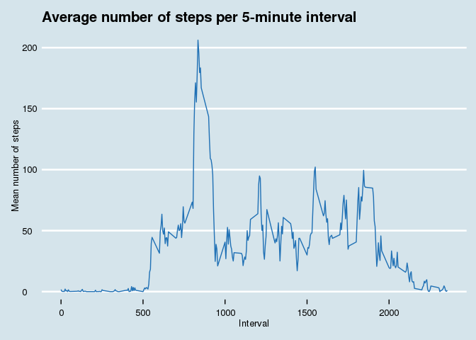
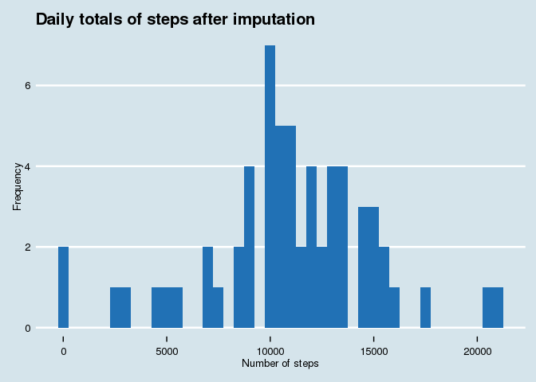
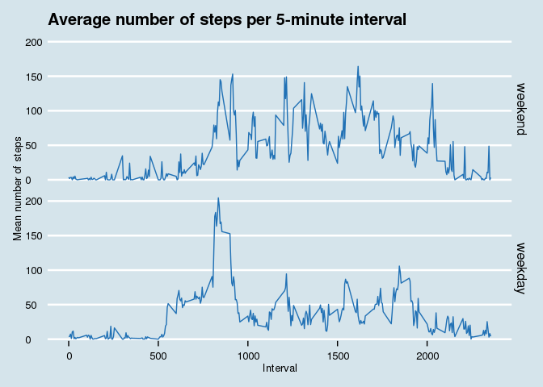

# Reproducible Research: Peer Assessment 1
Hugo van den Berg  
August 20, 2016  

## Introduction

This report describes a dataset containing the number of steps taken by an
anonymous person per 5-minute interval.
To perform this analysis a number of libraries have to be loaded first.


```r
# Reading data
library(readr) # v1.0.0

# Munging data
library(magrittr) # v1.5
library(dplyr) # v0.5.0
library(lubridate) # v1.5.6

# Imputation
library(mice) # v2.25

# Display data
library(xtable) # v1.8-2

# Plotting data
library(ggplot2) # v2.1.0
library(ggthemes) # v3.2.0
# library(plotly) # v3.6.0
```

## Loading and preprocessing the data

The next step is to extract the zipped datafile, if necessary.
The datafile is then read using the `readr` function `read_csv`.
Several options are passed to the `read_csv` function to ensure the data is 
parsed correctly, and the progress bar is always hidden.

Next is to create a number of variables to group by later.
These are the name of the weekday, and a logical indicating whether the day is 
in a weekend.

```r
# Unzip if the text file is not available
if (!file.exists('activity.csv')) {
    unzip('activity.zip')
}

# Read the data into a tibble data.frame, automatically parsing the dates
activity <- read_csv('activity.csv',
                     col_types = cols(steps = col_integer(),
                                      date = col_date(format = "%Y-%m-%d"),
                                      interval = col_integer()),
                     progress = FALSE)

# Create variables
activity %<>% 
    mutate(weekday = wday(date, label = TRUE, abbr = FALSE),
           weekend = factor(weekday %in% c("Saturday", "Sunday"),
                            levels = c(TRUE, FALSE), 
                            labels = c("weekend", "weekday")))

# Setup some constants for consistency
set.seed(42) # Make sure any stochastic processes use the same seed
color.blue <- "#2171B5" # RColorBrewer::brewer.pal(9, "Blues")[7]
```

## What is mean total number of steps taken per day?

To calculate the mean total number of steps per day first daily totals have to
be calculated.
Next a histogram is made showing the distribution of the number of steps per 
day (ignoring missing values).

The ggplotly function is used to add some interactivity to the plot.
By hovering the mouse over the bars the center value and count for that bin are
shown.

```r
daily_totals <- activity %>%
    group_by(date) %>%
    summarise(steps = sum(steps))
mean_daily_total <- mean(daily_totals$steps, na.rm = TRUE)
median_daily_total <- median(daily_totals$steps, na.rm = TRUE)

g <- daily_totals %>% ggplot(aes(steps)) +
    geom_histogram(fill = color.blue, binwidth = 500, na.rm = TRUE) +
    labs(title = "Daily totals of steps",
         x = "Number of steps",
         y = "Frequency") +
    theme_economist()
# Add labels on hover
# ggplotly(g)
print(g)
```

<!-- -->

From the plot above it is clear that most days somewhere between 10000 and 
15000 steps were taken by the subject.
The statistics confirm this visual observation with a mean value of 
**10766.19** steps and a median of **10765** steps.

## What is the average daily activity pattern?

To extract a daily activity pattern the average number of steps per 5-minute
interval is calculated, and plotted as a timeseries.

Note that the interval indices actually are times represented as an integer in
base ten, so after 55 the next index is 100, which is interpreted as a larger
step on the x-scale then from 50 to 55.
This causes some strangely long segments in the plot.

```r
five_minute_means <- activity %>%
    group_by(interval) %>%
    summarise(steps = mean(steps, na.rm = TRUE))

max_interval <- five_minute_means$interval[which.max(five_minute_means$steps)]
max_steps <- max(five_minute_means$steps)

g <- five_minute_means %>% 
    ggplot(aes(x = interval, y = steps)) +
    geom_line(color = color.blue) +
    labs(title = "Average number of steps per 5-minute interval",
         x = "Interval",
         y = "Mean number of steps") +
    theme_economist()
# ggplotly(g)
print(g)
```

<!-- -->

From the plot it is visible the most steps are taken around half past eight in
the morning.
The statistics confirm this: at 835 the number of steps on average
peaks to 206.17 steps per 5 minutes, or 
2474.04 steps per hour.

## Imputing missing values

All previous analyses have ignored the missing values for the number of steps
per interval.
Before we can continue we check in which columns data are missing, using the
`md.pattern` function from the `mice` package.

This shows the different missing data patterns in the dataset.
The first column shows the number of observations matching the pattern, while
the last column shows number of missing values in each matching observation.
The columns in between list a one if data is present, and a 0 if the data is 
missing.


```r
xt <- xtable(md.pattern(activity))
names(xt)[6] <- "Total missing"
print(xt, type = "html")
```

<!-- html table generated in R 3.3.1 by xtable 1.8-2 package -->
<!-- Sat Aug 20 21:18:11 2016 -->
<table border=1>
<tr> <th>  </th> <th> date </th> <th> interval </th> <th> weekday </th> <th> weekend </th> <th> steps </th> <th> Total missing </th>  </tr>
  <tr> <td align="right"> 15264 </td> <td align="right">   1 </td> <td align="right">   1 </td> <td align="right">   1 </td> <td align="right">   1 </td> <td align="right">   1 </td> <td align="right">   0 </td> </tr>
  <tr> <td align="right">  2304 </td> <td align="right">   1 </td> <td align="right">   1 </td> <td align="right">   1 </td> <td align="right">   1 </td> <td align="right">   0 </td> <td align="right">   1 </td> </tr>
  <tr> <td align="right">  </td> <td align="right">   0 </td> <td align="right">   0 </td> <td align="right">   0 </td> <td align="right">   0 </td> <td align="right"> 2304 </td> <td align="right"> 2304 </td> </tr>
   </table>

From this table we can see that 15264 observations
have no missing values, while 2304 observations
lack a value for the `steps` variable.

To impute the datatwo other functions from the `mice` package is used, called
`mice` itself (MICE is an acronym for Multivariate Imputation by Chained
Equations) and `complete`.
`mice` imputes data based on all available variables, in this case using
*Predictive Mean Matching*, and returns an object containing the original data
and imputations separately.
`complete` then merges those two to a dataset without missing data.


```r
imputed <- activity %>%
    # MICE can only handle numeric data for imputation
    mutate(date = as.numeric(date)) %>%
    # printFlag = FALSE prevents a long list of iterations showing
    mice(method = "pmm", printFlag = FALSE) %>%
    complete %>%
    # Convert the numeric dates back to dates
    mutate(date = as.Date(date, origin = '1970-1-1'))
```

To check the imputation we again calculate the distribution of the total steps
taken daily.


```r
daily_totals <- imputed %>%
    group_by(date) %>%
    summarise(steps = sum(steps))
mean_daily_total_imputed <- mean(daily_totals$steps, na.rm = TRUE)
median_daily_total_imputed <- median(daily_totals$steps, na.rm = TRUE)

g <- daily_totals %>% ggplot(aes(steps)) +
    geom_histogram(fill = color.blue, binwidth = 500, na.rm = TRUE) +
    labs(title = "Daily totals of steps after imputation",
         x = "Number of steps",
         y = "Frequency") +
    theme_economist()
# Add labels on hover
# ggplotly(g)
print(g)
```

<!-- -->

Visually the distribution looks similar to the non-imputed data.
The median of the imputed steps variable is 11044 
(compared to 10765 before), while the mean is
1.0941705\times 10^{4} (compared to 1.0941705\times 10^{4} before).

Both values have gone up slightly. 
This is to be expected as the imputed values are all greater than or equal to
zero, so for a number of days the total steps has gone up.
Therefore the median and mean of the daily totals will go up as well.

## Are there differences in activity patterns between weekdays and weekends?

Finally we want to see if there are differences in the activity patterns 
between weekdays and weekends.
Therefore we repeat the timeseries plot, this time using the imputed data, and
faceting the data with the `weekend` variable we created directly after loading
the data.


```r
five_minute_means <- imputed %>%
    group_by(weekend, interval) %>%
    summarise(steps = mean(steps, na.rm = TRUE))

max_interval <- five_minute_means$interval[which.max(five_minute_means$steps)]
max_steps <- max(five_minute_means$steps)

g <- five_minute_means %>% 
    ggplot(aes(x = interval, y = steps)) +
    geom_line(color = color.blue) +
    facet_grid(weekend ~ .) +
    labs(title = "Average number of steps per 5-minute interval",
         x = "Interval",
         y = "Mean number of steps") +
    theme_economist()
# ggplotly(g)
print(g)
```

<!-- -->

There appears to be quite some difference between the activities on weekdays
compared to weekends.
During weekends activity starts later, and with a much less pronounced peak
around 9 o'clock in the morning.
Also during weekdays there is much less activity during the day compared to 
weekends.
